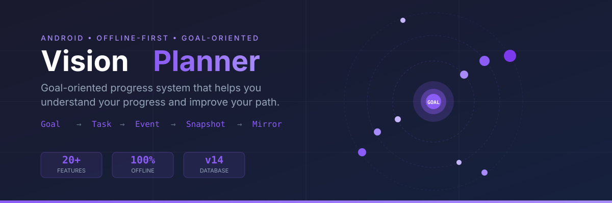

<p align="center">
  
</p>

<h1 align="center">Vision Planner</h1>

<p align="center">
  <strong>Goal-oriented progress system</strong> that helps you understand your progress,<br>
  identify behavioral patterns, and improve your path toward meaningful goals.
</p>

<p align="center">
  
  
  
  
  
</p>

---

## 💡 Product Philosophy

> *"Creating a task should feel like capturing a thought, not filling a form."*

**Non-negotiable principles:**

| # | Principle | Description |
|---|-----------|-------------|
| 1 | **Goal > Task** | A task is merely a unit of execution under a goal |
| 2 | **Low friction, high signal** | Task creation must be rapid and optional in structure |
| 3 | **Feedback, not judgment** | Insights describe behavior — they don't criticize |
| 4 | **Invisible data collection** | No forced journals, daily reflections, or mandatory check-ins |
| 5 | **Offline-first** | Everything stays on-device. Zero network dependency |

---

## 🧠 Core Mental Model

```
Goal → Task → Event → Snapshot → Mirror → Feedback
```

| Component | Role |
|-----------|------|
| **Goal** | Meaningful direction |
| **Task** | Smallest execution unit |
| **Event** | State transitions: created, completed, rescheduled |
| **Snapshot** | Daily progress & behavior projections |
| **Mirror** | Pattern detection + feedback inside Goal Dashboard |

---

## ✨ Features

### Implemented (Phase 1–6)

<table>
<tr>
<td width="50%">

**🎯 Goal Management**
- Create, complete, pause, resume, abandon, delete goals
- Goal Detail Screen with stats & linked tasks
- Goal–Task linking with FK relationship
- Completion rate tracking

**📝 Task System**
- Day-based task creation & completion
- Task editing & goal reassignment
- HIGH / MEDIUM / LOW priority
- AlarmManager-based reminders
- Jalali Calendar Picker

**📊 Insights**
- Streak, velocity, procrastination alerts
- Weekly Insight Card
- Cross-module search
- Real-time search across tasks + notes

</td>
<td width="50%">

**🪞 Mirror Engine (V1)**
- Boulder detection (avoided tasks)
- Initiator vs Finisher patterns
- Goal Attention tracking
- Consistency Decay analysis
- Neutral feedback language

**🌌 Behavioral Solar System**
- Goal-centered graph visualization
- Attention-driven task positioning
- Adaptive clusters for >8 tasks
- Staged entrance animation
- Breathing shimmer effects

**🎨 Design System**
- Neumorphic components
- Light / Dark / System theme
- RTL Persian/Farsi UI
- Persian digits & week
- Plugin architecture

</td>
</tr>
</table>

### Coming Soon

| Feature | Status | Notes |
|---------|--------|-------|
| AI Insight Layer | 🔜 | Phase 7: Uses structured events & Mirror outputs |
| Task Inbox behavior | 🔜 | Quick capture without goal assignment |
| Goal-first main layout | 🔜 | Preserve daily flow while emphasizing goals |

---

## 🏗️ Architecture

### Tech Stack

<table>
<tr><td><strong>Language</strong></td><td>Kotlin</td><td><strong>UI</strong></td><td>Jetpack Compose + Material3</td></tr>
<tr><td><strong>Database</strong></td><td>Room (v14)</td><td><strong>Async</strong></td><td>Coroutines + Flow</td></tr>
<tr><td><strong>Architecture</strong></td><td>MVVM</td><td><strong>Persistence</strong></td><td>Offline-first local</td></tr>
<tr><td><strong>Build</strong></td><td>Gradle</td><td><strong>Min SDK</strong></td><td>24 / Target 36</td></tr>
</table>

### Data Flow

```
Room DAO (Flow) → Repository → ViewModel StateFlow → Compose collectAsState
```

- All reads are reactive via Room `Flow`
- Writes use `suspend` functions in ViewModels
- Insight/mirror math lives in pure-Kotlin domain calculators

### Database Schema (v14)

```
goals              → GoalEntity (id, title, description, status)
goal_events        → GoalEventEntity (id, goalId FK, eventType)
tasks              → TaskEntity (id, title, priority, goalId FK)
activity_events    → ActivityEventEntity (id, taskId, eventType)
task_steps         → TaskStepEntity (id, taskId FK, title, isCompleted)
behavior_snapshot  → BehaviorSnapshotEntity (dateEpochMs, streak, velocity)
```

### Plugin System

```kotlin
interface AppPlugin {
    val id: String
    val name: String
    val icon: ImageVector
    
    @Composable
    fun Content(modifier: Modifier, onNavigateToSettings: () -> Unit, onBack: () -> Unit)
}
```

**Registered plugins:** Planner • Goals • Notes

---

## 🪞 Behavioral Insights & Mirror

### Mirror V1 Patterns

| Pattern | Icon | Description |
|---------|------|-------------|
| **Boulder** | 🪨 | Tasks being avoided (rescheduled ≥ 2x) |
| **Initiator vs Finisher** | ⚡ | Starts many tasks but completes few |
| **Goal Attention** | 👁️ | Goals receiving less attention recently |
| **Consistency Decay** | 📉 | Declining activity over time |

### Mirror Constraints

- No separate Mirror screen in V1
- Feedback appears inside Goal Detail
- No forced input, no judgmental language
- Real analysis matures after ~7 days of usage

---

## 🌌 Behavioral Solar System

The graph is a **Behavioral Understanding Tool**, not a generic data visualization.

```
         ☀️ Goal (Sun)
        / | \
       /  |  \
      🪐  🪐  🪐  Tasks (Orbiting satellites)
     / |  |  | \
    •  •  •  •  •  Positioned by attention score
```

- **Goal = Sun** (center, with progress ring + glow)
- **Task = Orbiting satellite** (positioned by attention)
- **Adaptive clusters** for goals with >8 tasks
- **Motion language:** staged entrance, breathing shimmer

---

## 🚀 Build & Develop

### Requirements

- JDK 17
- Android SDK 36
- Gradle 9+
- Android platform-tools (adb)

### Build

```bash
./gradlew assembleDebug
```

APK output: `app/build/outputs/apk/debug/app-debug.apk`

### Install on Device

```bash
adb install -r app/build/outputs/apk/debug/app-debug.apk
```

### Development Environment

```
VS Code + Android SDK CLI + Gradle CLI + Real Android Device
```

Android Studio is not required.

---

## 📋 Development Phases

| Phase | Status | Description |
|-------|--------|-------------|
| Phase 1 | ✅ | Schema stabilization, Goal→Task FK |
| Phase 2 | ✅ | Architecture stabilization, domain layer |
| Phase 3 | ✅ | Progress & behavior snapshots |
| Phase 4 | ✅ | Mirror Engine Foundation |
| Phase 5 | ✅ | Goal Experience Evolution |
| Phase 6 | ✅ | Behavioral Solar System |
| Phase 7 | 🔜 | AI Insight Generator |

---

## ⚠️ Constraints

This project intentionally avoids:

- ❌ Premature architecture expansion
- ❌ Framework-first development
- ❌ Feature accumulation without validation
- ❌ AI-first workflows before product validation
- ❌ Network dependencies
- ❌ Mandatory organization

---

## 📚 Documentation

- [`PRODUCT_DIRECTION_DECISION_DOCUMENT.md`](PRODUCT_DIRECTION_DECISION_DOCUMENT.md) — Latest product decisions
- [`docs/ARCHITECTURE_STATE.md`](docs/ARCHITECTURE_STATE.md) — Current architecture status
- [`docs/ROADMAP.md`](docs/ROADMAP.md) — Implementation roadmap

---

<p align="center">
  
</p>
